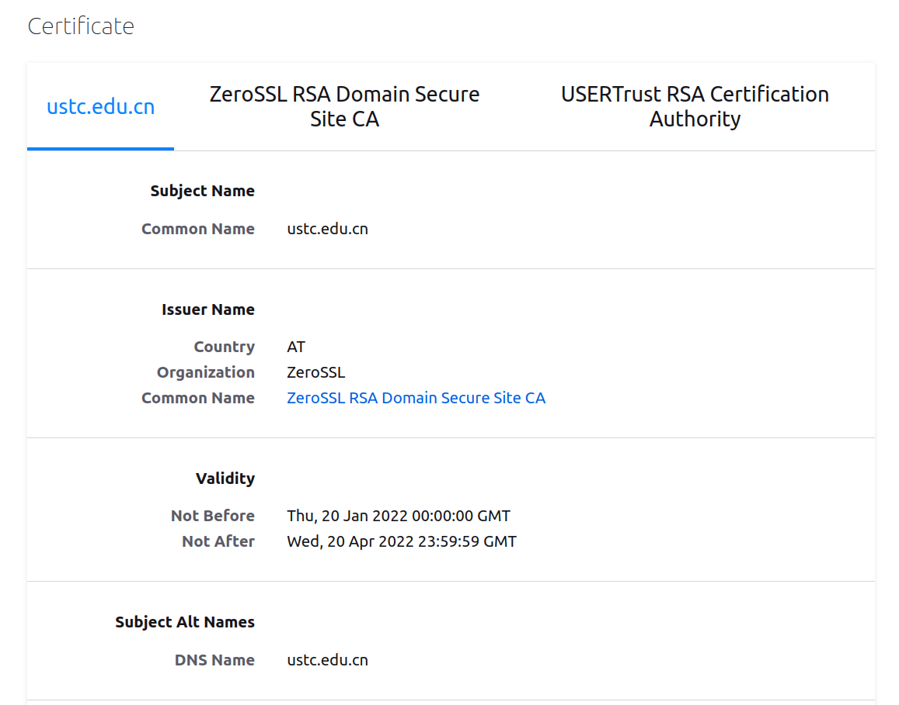
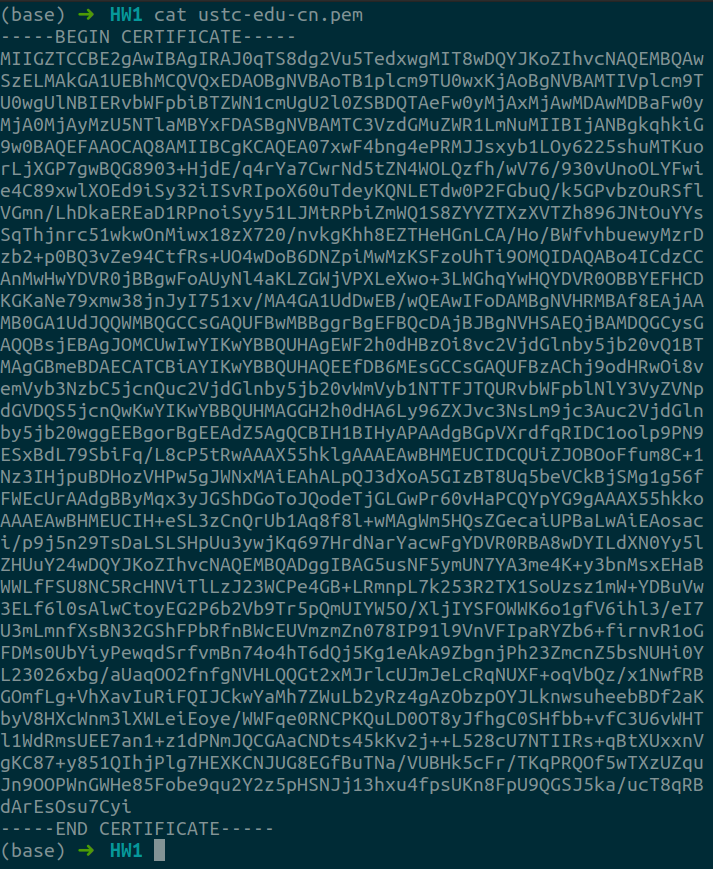
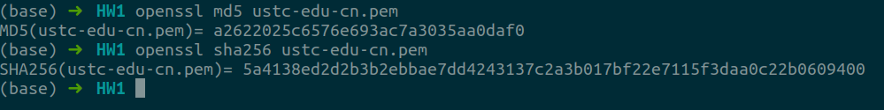
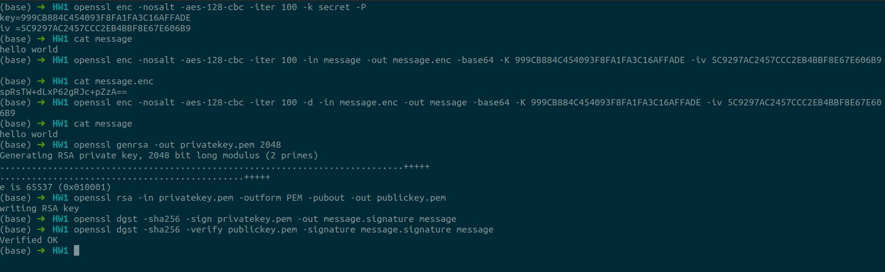

# #1

PB19111701

### 1

**Question:**

What are the risks of having the US government select a cryptosystem for widespread commercial use (both inside and outside the United States). How could users from outside the United States overcome some or all of these risks?

**Answer:**

1. The risk comes from the possibility of the existence of government-mandated back-doors in the cryptosystem. That is to say, US government can take advantage of the undetected vulnerabilities of the selected cryptosystem, so that confidential information encrypted by this cryptosystem is transparent to the US government.

2. To overcome this risk, users can encrypt the same message several times by different encryption methods from different cryptosystems. Therefore, vulnerabilities from one of these cryptosystems wouldn't completely ruin the confidentiality of the encrypted message.

### 2

**Question:**

Explain why hash collisions occur. That is, why must there always be two different plaintexts that have the same hash value? What property of a hash function means that collisions are not a security problem. That is, why can an attacker not capitalize on collisions and change the underlying plaintext to another form whose value collides with the hash value of the original plaintext?

**Answer:**

1. The occurrence of hash collisions is inevitable because the length of $H(m)$ is finite. That is, it is mathematically impossible to map infinite random-length messages to finite hash values of fixed length in one-to-one correspondence.
2. *Collision resistance* (抗碰撞性) is the property keeping hash collisions from being a security problem. In case of *strong collision resistance*, given a hash function $H$, it is computationally impossible to find two different messages $M_1$ and $M_2$, such that $H(M_1)=H(M_2)$. In case of *weak collision resistance*, given a hash function $H$ and a random message $M_1$, it is computationally impossible to find a message $M_2$ such that $H(M_1)=H(M_2)$.

### 3

**Question:**

Identify the CA that has issued the TLS certificate for https://ustc.edu.cn/. Also, identify the certificate expiration date. Besides, export the TLS certificate into a `pem` file (e.g., through openssl), and calculate its `md5` hash and `SHA256` hash.

**Answer:**

Open the website in Firefox and we can get the certificate information as follows:

Therefore, the CA issuing the TLS certificate for the website is **ZeroSSL RSA Domain Secure Site CA**, and the expiration date is **Wed, 20 Apr 2022 23:59:59 GMT**.

Export TLS certificate into a `pem` file, then we can get:

Calculate its `md5` and `SHA256` hash, the result is showed as below:

### 4

**Question:**

Encrypt/Decrypt/Sign through openssl:

a) generation and verificationGenerate an `AES-128 key` with the cipher mode of CBC through openssl
b) encrypt a message m and decrypt it back using the above `AES-128-cbc` secrets.
c) Generate a public and private key pair
d) generate a `sha256` hash of the message m, and generate a signature by encrypting the hash with your private key
e) Verify the digital signature, with your public key
f) Take screenshots of step a-e, and embed them in the submission pdf.

**Answer:**

> reference: https://wiki.openssl.org/index.php/Command_Line_Utilities

### 5

**Question:**

Read the following paper, summarize its ideas, and give your critical reviews: “New Directions in Cryptography” by Whitfield Diffie and Martin Hellman.

**Answer:**

summary:

1. motivation: minimize the need for secure key distribution channels and supply the equivalent of a written signature;
2. discussions over *public key cryptosystem* and *public key distribution system*;
3. *digital signature* and *one-way authentication* through public key cryptosystem;
4. possibility of extending proofs of security to more useful classes systems with the theory of computaional complexity and analysis of algorithms;

critical reviews:

1. security should be achieved with fewer assumptions (extra conditions) as possible;
2. development of new cryptosystems should meet the comtemporary requests of hardware and software;
