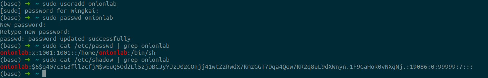
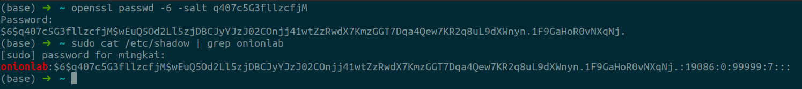
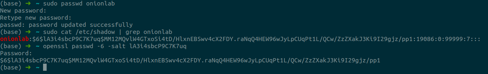
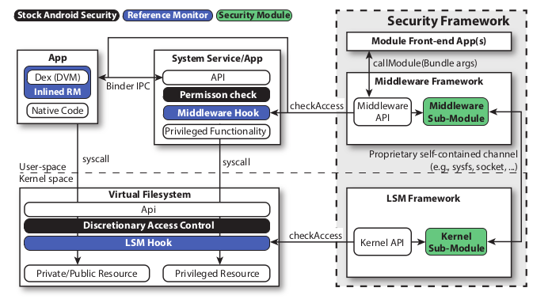

# #2

1 人： PB19111701 李铭铠

### 1

**Question:**

In Unix, every process has a real user id (ruid), an effective user id (euid), and a saved user id (suid). Processes with an euid of 0 have special root privileges.

#### a

If a process with user id n forks to create another process, what user id does the new process have? (Hint: it's the same answer for euid, ruid, and suid.)

**Answer:**

The new process inherits euid/ruid/suid from its parent process. That is, when the calling process has:

| euid     | x     |
| -------- | ----- |
| **ruid** | **n** |
| **suid** | **y** |

then, the new process has the same:

| euid     | x     |
| -------- | ----- |
| **ruid** | **n** |
| **suid** | **y** |

#### b

If a process with euid n makes a setuid system call, what possible euids can the process run with after the call, in each of the following situations:

- Before: euid = n > 0, saved user id suid=m and real user id ruid = m. After:?
- Before: n=0 After:?

**Answer:**

In the 1st situation:

euid can be set as *ruid* or *suid*, i.e. m;

In the  2nd situation:

since the process has *root* privilege, its *euid* can be set as any ID after *setuid* system call.

#### c

Each Android application runs in a separate process using a separate user id. From a security standpoint, what is the advantage of assigning separate uids instead of using the same uid for all? Explain.

**Answer:**

Pros:

1. Provide memory protection: a separate process with different uid is denied to access the memory of another process unless explicitly granted;
2. Communication limited using Unix domain sockets;
3. Only ping, zygote run as root: assigning processes with separate uids allows to limit the root privilege to certain group of system applications;

#### d

The Android zygote process that creates new processes runs as root. After forking to create a new process, setuid is normally called. Explain what uid the new process has initially and why it is important to call setuid? What security purpose does this serve?

**Answer:**

Assuming zygote process has

| euid     | 0     |
| -------- | ----- |
| **ruid** | **x** |
| **suid** | **y** |

after forking to create a new process, uid of the new process is inherited from its parent, i.e.

| euid     | 0     |
| -------- | ----- |
| **ruid** | **x** |
| **suid** | **y** |

It is important to call *setuid* after *fork*, because the new process would be granted *root* privilege otherwise. *setuid* serves to fulfill the security purpose of *least privilege*, that is a process should only be granted with least permissions so as to perform its basic functions.

#### e

When a Unix user wishes to change her password, she uses the passwd program. The Unix password file is usually publicly readable but (for obvious reasons) can only be written by processes with root privileges.

- How should the setuid bit be set on this passwd program? Explain how this lets a user change her password.
- Why does this make it important to write the passwd program source code carefully?

**Answer:**

1. `passwd` program should have `setuid bit`  be set. In this case, the *euid* and *suid* will be assigned the user ID of the owner of the new file (namely *root* in this case), therefore the modification of the file is possible. Otherwise, ruid/euid/suid will be inherited from the parent, thus it is impossible to make any modification.
2. `passwd` program can make modifications to the password. Consequently, if the program is not carefully written, it is possible for the attackers to take advantages of the vulnerabilities of the program to change the password and get root privilege. Once the attacker gets the password, all the access control techniques will become useless.

### 2

**Question:**

Consider the following code snippet:

```c
if (!stat("./file.dat", buf)) return; // abort if file exists
sleep(10);
// sleep for 10 seconds
fp = fopen("./file.dat", "w" );
// open file for write
fprintf(fp, "Hello world" );
close(fp);
```

#### a

Suppose this code is running as a setuid root program. Give an example of how this code can lead to unexpected behavior that could cause a security problem. Hint: try using symbolic links.

**Answer:**

If an attacker create a symbolic link `file.dat`, which points to an important file in a different location,  in the current directory after the execution of `stat()` and before the execution of `fopen()`. Since the program is now granted root privilege,  it is able to modify the content in this important file to `Hello World`. In this case, the data in this important file would be completely lost.

#### b

Suppose the sleep(10) is removed from the code above. Could the problem you identified in part (a) still occur? Please explain.

**Answer:**

The problem will still occur. The reason is that the execution of `stat`, `fopen` and `fprintf` has considerable latency, and it is potantially enough for the attacker to exploit the vulnerability.

#### c

How would you fix the code to prevent the problem from part (a)?

**Answer:**

This is a typical **Time-of-Check-to-Time-of-Use (TOCTTOU)** race condition. An efficient way to prevent the problem is to use mutex to control the accesss to `./file.data`. That is,

```c
down(&mutex);
if (!stat("./file.dat", buf)) return; // abort if file exists
sleep(10);
// sleep for 10 seconds
fp = fopen("./file.dat", "w" );
// open file for write
fprintf(fp, "Hello world" );
close(fp);
up(&mutex);
```

### 3

**Question:**

Assume that passwords are limited to the use of the 95 printable ASCII characters and that all passwords are 10 characters in length. Assume a password cracker with an encryption rate of 6.4 million encryptions per second. How long will it take to test exhaustively all possible passwords on a UNIX system?

**Answer:**
$$
\text{time} =& \frac{95^{10}}{6.4 \times 10^{9}}\text{ second}\\
=& 9355264675.59967041 \text{ second}\\
\approx & 296.65 \text{ year}
$$

### 4

**Question:**

It was stated that the inclusion of the salt in the UNIX password scheme increases the difficulty of guessing by a factor of 4096. But the salt is stored in plaintext in the same entry as the corresponding ciphertext password. Therefore, those two characters are known to the attacker and need not be guessed.

#### a

Why is it asserted that the salt increases security?

**Answer:**

Since a simple password is tended to be used by multiple users, without adding different salts to different users, the same passwords will result  in the same hash values which are stored in the database. Therefore, once an attacker cracks one of them, all of them are cracked together. That is called a *rainbow table attack*. However, with different salts added into hash, it is computationally more difficult to gerente a rainbow table even if all salts are in plain text. Thus, the security is increased.

#### b

Wouldn’t it be possible to completely thwart all password crackers by dramatically increasing the salt size to, say, 24 or 48 bits?

**Answer:**

Granted, with a longer salt, it would be even more computationally difficult for rainbow table attacks to occur. However, it is still possible to find a same hash value if the user adopts a weak and common password, after trying all salt combinations for a single simple password. Therefore, it is impossible to completely thwart all crackers by simply increasing the salt size.

### 5

**Question:**

The VAX/VMS operating system makes use of four processor access modes to facilitate the protection and sharing of system resources among processes. The access mode determines:

- **Instruction execution privileges**: What instructions the processor may execute;
- **Memory access privileges**: Which locations in virtual memory the current instruction may access;

The four modes are as follows:

- *Kernel*: Executes the kernel of the VMS operating system, which includes memory management, interrupt handling, and I/O operations;
- *Executive*: Executes many of the operating system service calls, including file and record (disk and tape) management routines;
- *Supervisor*: Executes other operating system services, such as responses to user commands;
- *User*: Executes user programs, plus utilities such as compilers, editors, linkers, and debuggers;

A process executing in a less-privileged mode often needs to call a procedure that executes in a more-privileged mode; for example, a user program requires an operating system service. This call is achieved by using a change-mode (CHM) instruction, which causes an interrupt that transfers control to a routine at the new access mode. A return is made by executing the REI (return from exception or interrupt) instruction.

#### a

A number of operating systems have two modes, kernel and user. What are the advantages and disadvantages of providing four modes instead of two?

**Answer:**

1. Advantage: with extra 2 modes, a more fine-grained control of instruction/memory access would be possible. At each mode, unnecessary permissions would not be granted, thus better serving the *least privilege* goal.
2. Disadvantage: the overhead is significantly increased by adding 2 extra modes. The transferation between different modes would be more frequent, resulting in time and space overhead brought about by context switching.

#### b

Can you make a case for even more than four modes?

**Answer:**

Here is an example:

- *Kernel*: Executes the kernel of the VMS operating system, which includes memory management, interrupt handling, and I/O operations;
- *Executive*: Executes many of the operating system service calls, including file and record (disk and tape) management routines;
- *Supervisor*: Executes other operating system services, such as responses to user commands;
- *Root*: Executes user programs with root priviledge;
- *User*: Executes other user programs, plus utilities such as compilers, editors, linkers, and debuggers;

However, the more modes are specified, the bigger overhead is created.

### 6

**Question:**

A lab to understand user/password management on Unix/Linux

a) Create a user X with home directory, and set up its password Y (hints: commands useradd and passwd)
b) Look into the passwd file (/etc/passwd), and locate the entry of your newly created user X, Look into the file (/etc/shadow) storing the salted password hash, identify the entry for your newly created user X
c) Understand the shadow entry format, parse out the salt, the salted password hash, as well as the hash algorithm
d) Utilize openssl passwd to recalculate the password hash, and compare with the one stored in /etc/shadow
e) Change the password for User X, and redo d and e

**Answer:**

#### a & b

> passwd: onionlab123



#### c

shadow entry format: `$id$salt$encrypted`, separated by `$`. `id` specifies the hash algorithm used as follows:

| ID   | Method                                                       |
| ---- | ------------------------------------------------------------ |
| 1    | MD5                                                          |
| 2a   | Blowfish (not in mainline glibc;added in some Linux distribution) |
| 5    | SHA-256(since glibc 2.7)                                     |
| 6    | SHA-512(since glibc 2.7)                                     |

therefore, we have

1. hash algorithm: SHA-512

2. salt:

   `q407c5G3fllzcfjM`

3. salted password hash: 

   `wEuQ5Od2Ll5zjDBCJyYJzJ02COnjj41wtZzRwdX7KmzGGT7Dqa4Qew7KR2q8uL9dXWnyn.1F9GaHoR0vNXqNj.`

#### d



#### e

> passwd: onionlab567



### 7

**Question:**

Read the following paper, summarize its ideas, and give your critical reviews: Backes, Michael, Sven Bugiel, Sebastian Gerling, and Philipp von Styp-Rekowsky. **"Android security framework: Extensible multi-layered access control on android."** In Proceedings of the 30th annual computer security applications conference, pp. 46-55. 2014.

**Answer:**

Summary:

1. motivation: the lack of a comprehensive security API for the development and modularization of security extensions on Android has created the unsatisfactory situation that all of these novel and warranted security models are either provided as model-specific patches to the Android software stack, or they became an integrated component of the Android OS design;

2. contribution: the paper presents an extensible, policy-agnostic and multi-tiered security insfastructure called ASF, which povides Android security API to deploy solutions in form of modules or security apps;

3. architecture:

   

Review: security features will be truly useful and influential only when it can be implemented properly, succinctly and conviniently. Otherwise, its effectiveness would be limited to a small feild by many pratical problems.
