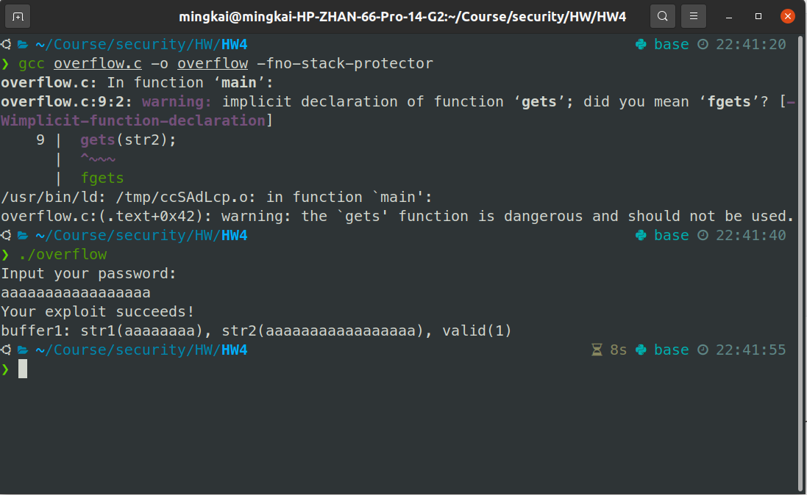

# #4

PB19111701

## 1

**Question:**

Describe what a NOP sled is and how it is used in a buffer overflow attack.

**Answer:**

A NOP sled is a trick for writing robust exploits by adding a sequence of NOPs before the actual shellcode. With the help of a NOP sled, landing anywhere in the sled will eventually bring the execution of the program to the shellcode after several NOP instructions which do nothing at all. Consequently, in a buffer overflow attack, RIP of the previous stack frame needs only being set as one of the addresses in the NOP sled. That is to say, the attack only needs to be aware of the approximate address of the beginning of the shellcode instead of the exact one for successfully carrying out a buffer overflow attack.


## 2

**Question:**

Look into different shellcodes released in [Packet Storm](https://packetstormsecurity.com/files/tags/shellcode/), and summarize different operations an attacker may design shellcode to perform.

**Answer:**

1. to break access control, e.g.

   [**Windows/x86 Add User Alfred Shellcode**](https://packetstormsecurity.com/files/download/161513/240winalfred-shellcode.txt)

   [**NTLM BITS SYSTEM Token Impersonation**](https://packetstormsecurity.com/files/download/160829/bits_ntlm_token_impersonation.rb.txt)

   [**Linux/x86 Add Root User Shellcode**](https://packetstormsecurity.com/files/download/157392/Linux_x86-AddRootUser.c)

   [**Solaris/SPARC chmod() Shellcode**](https://packetstormsecurity.com/files/download/166047/sparc_solaris_chmod.c)

2. to escape security protections (such as firewall, sandbox), e.g.

   [**Microsoft Windows Firewall Disabling Shellcode**](https://packetstormsecurity.com/files/download/157305/AddRDPAdmin_RDPOn_FWOff_win32Shellcode.txt)

   [**Safari Type Confusion / Sandbox Escape**](https://packetstormsecurity.com/files/download/159447/safari_in_operator_side_effect.rb.txt)

3. to execute an unauthenticated code or to download an unauthenticated file, e.g.

   [**Solaris/SPARC execve() Shellcode**](https://packetstormsecurity.com/files/download/166046/sparc_solaris_exec.c)

   [**Windows/x86 Download File / Execute Shellcode**](https://packetstormsecurity.com/files/download/165851/458windlexec-shellcode.txt)

   [**Cisco RV340 SSL VPN Unauthenticated Remote Code Execution**](https://packetstormsecurity.com/files/download/167113/cisco_rv340_sslvpn.rb.txt)

4. egg hunter, i.e. a small shellcode for searching and executing another big shellcode when the exploitable buffer is too small for the big one, e.g.

   [**Linux/x86 Egghunter Shellcode**](https://packetstormsecurity.com/files/download/157391/Linux_x86-Egghunter.c)

   [**Linux/x64_86 Egghunter Execve Shellcode**](https://packetstormsecurity.com/files/download/157394/Linux_x64-EggHunter%2BExecve.c)

5. to change network configurations, e.g.

   [**Windows/x86 Bind TCP Shellcode**](https://packetstormsecurity.com/files/download/164427/415winx86-shellcode.txt)

   [**Windows/x86 Reverse TCP Shellcode**](https://packetstormsecurity.com/files/download/164131/Windows_x86_Reverse_TCP_Shellcode_192_168_201_11_4444_330_Bytes_PoC.c)

   [**Linux/ARM TCP Port 4444 Binding Shellcode**](https://packetstormsecurity.com/files/download/149560/linuxarmbind4444-shellcode.txt)

6. to encrypt files, e.g.

   [**Linux/x86 OpenSSL File Encryption Shellcode**](https://packetstormsecurity.com/files/download/152719/185byteslinuxx86encrypt-shellcode.txt)

7. to crash the operating system, e.g.

   [**Linux/x64 Kill All Processes Shellcode**](https://packetstormsecurity.com/files/download/151964/linkillall-shellcode.txt)

​	etc.


## 3

**Question:**

Below is a simple C code with a buffer overflow issue.

```cpp
#include <stdio.h>
#include <string.h>
int main(int argc, char *argv[]) {
	int valid = false;
	char str1[9] = "fdalfakl";
	char str2[9];
	printf("Input your password:\n");
	gets(str2);
	if (strncmp(str1, str2, 8) == 0) {
		valid = true;
		printf("Your exploit succeeds!\n");
	}
	printf("buffer1: str1(%s), str2(%s), valid(%d)\n", str1, str2, valid);
}
```

### a

**Question:**

Craft a simple buffer overflow exploit, and circumvent the password checking logic. Include in your submission necessary step-by-step screenshots or descriptions to demonstrate how you carry out the attack.

**Answer:**



### b

**Question:**

Describe how to fix this buffer overflow issue.

**Answer:**

Use `fgets` instead of `gets`, so that the library will check the input and discard the remaining part which is out of the size of the array.


## 4

**Question:**

Alice is attacking a buggy application. She has found a vulnerability that allows her to control the values of the registers ecx, edx, and eip, and also allows her to control the contents of memory locations 0x9000 to 0x9014. She wants to use return-oriented programming, but discovers that the application was compiled without any ret instructions! Nonetheless, by analyzing the application, she learns that the application has the following code fragments (gadgets) in memory:

```
0x3000: add edx, 4		; edx = edx + 4
		jmp [edx]		; jump to *edx
		
0x4000: add edx, 4		; edx = edx + 4
		mov eax, [edx]	; eax = *edx
		jmp ecx			; jump to ecx
		
0x5000: mov ebx, eax	; ebx = eax
		jmp ecx			; jump to ecx
		
0x6000: mov [eax], ebx	; *eax = ebx
		...				; don't worry about what happens after this
```

Show how Elizabeth can set the values of the registers and memory so that the vulnerable application writes the value 0x2222 to memory address 0x8888.

**Answer:**

| ecx  | 0x3000 |
| ---- | ------ |
| edx  | 0x9000 |
| eip  | 0x4000 |

| 0x9000 |        |
| ------ | ------ |
| 0x9004 | 0x2222 |
| 0x9008 | 0x5000 |
| 0x900c | 0x4000 |
| 0x9010 | 0x8888 |
| 0x9014 | 0x6000 |


## 5

**Question:**

Consider the following simplified code that was used earlier this year in a widely deployed router. If hdr->ndata = "ab" and hdr->vdata = "cd" then this code is intended to write "ab:cd" into buf. Suppose that the attacker has full control of the contents of hdr. Explain how this code can lead to an overflow of the local buffer buf.

```cpp
uint32_t nlen, vlen;	/* values in 0 to 2^32-1 */
char buf[8264];

nlen = 8192;
if ( hdr->nlen <= 8192 )
	nlen = hdr->nlen;

memcpy(buf, hdr->ndata, nlen);
buf[nlen] = ':';

vlen = hdr->vlen;
if (8192 - (nlen+1) <= vlen )	/* DANGER */
	vlen = 8192 - (nlen+1);

memcpy(&buf[nlen+1], hdr->vdata, vlen);
buf[nlen + vlen + 1] = 0;
```

**Answer:**

Set `hdf->nlen` as a `unit32_t` s.t. its value is bigger than or equal to `8192`. In this case, `nlen` will be set as `8192` before the second `if` statement. Since the type of `nlen` is `unit32_t`, i.e. the value of `nlen` will be treated as an unsigned integer, `8192 - (nlen+1)` is regared as $2^{32}-1$ (that is $-1$ if regared as a signed integer). Consequently, regardless of the value of `vlen`, the condiction expression of the second `if` statement will always be false. Thus the value of `vlen` is bound to be set as the same as the value of `hdr->vlen`. Just set `hdf->vlen` as a `unit32_t` s.t. its value is bigger than or equal to `72`. There would be a buffer overflow after the execution of the program.